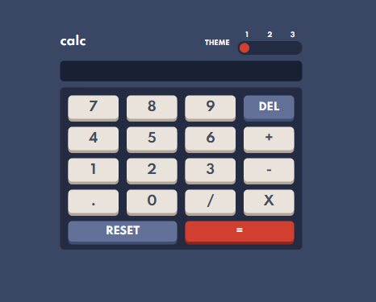
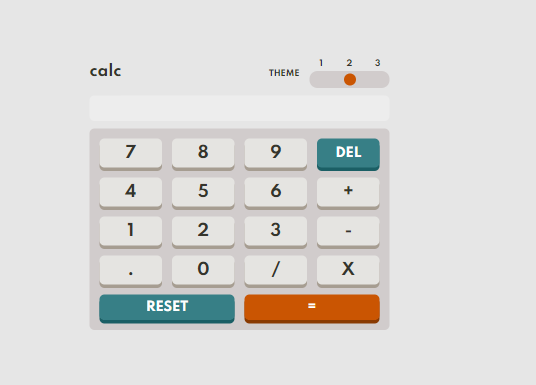
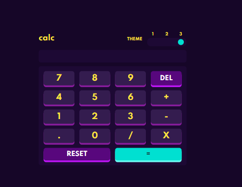

# Frontend Mentor - Calculator app solution

This is a solution to the [Calculator app challenge on Frontend Mentor](https://www.frontendmentor.io/challenges/calculator-app-9lteq5N29). Frontend Mentor challenges help you improve your coding skills by building realistic projects. 

## Table of contents

- [Overview](#overview)
  - [The challenge](#the-challenge)
  - [Screenshot](#screenshot)
  - [Links - WIP](#links)
  - [Built with](#built-with)
- [Author](#author)
- [Acknowledgments](#acknowledgments)

## Overview

### The challenge

Users should be able to:

- See the size of the elements adjust based on their device's screen size
- Perform mathmatical operations like addition, subtraction, multiplication, and division
- Adjust the color theme based on their preference
- **Bonus**: Have their initial theme preference checked using `prefers-color-scheme` and have any additional changes saved in the browser - TO DO

### Screenshot
Theme 1:

Theme 2:

Theme 3:

### Links

CodePen: https://codepen.io/mich-sue9/pen/XWMzYxO

### Built with

- Semantic HTML5 markup
- CSS custom properties
- JavaScript
- Flexbox
- CSS Grid
- Mobile-first workflow

## Author

- Website - WIP 
- Frontend Mentor - [@mich-sue9](https://www.frontendmentor.io/profile/mich-sue9)

## Acknowledgments

Shout out to Frontend Mentors for these challenges!